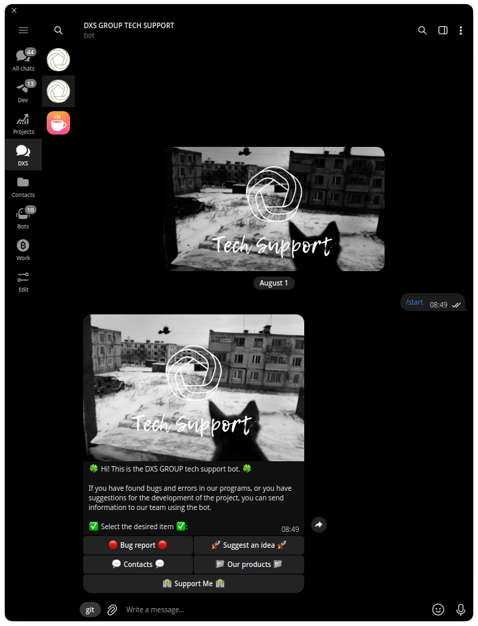
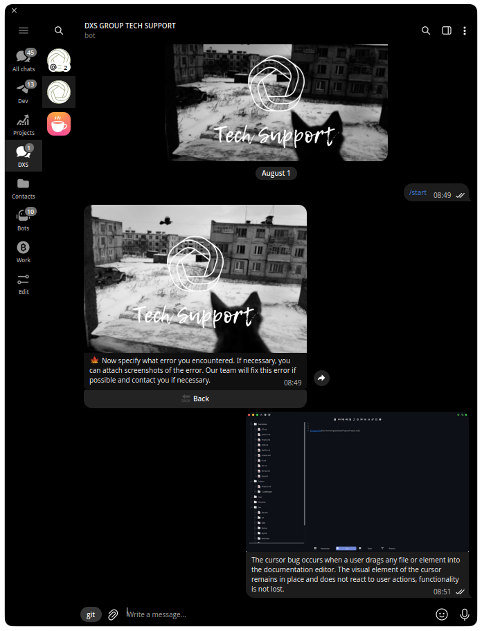
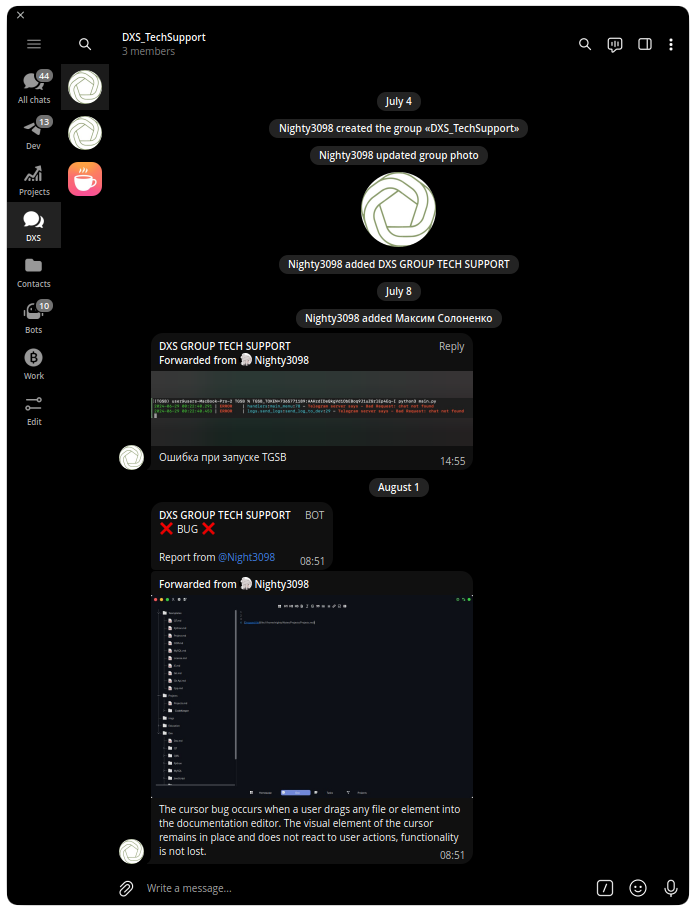
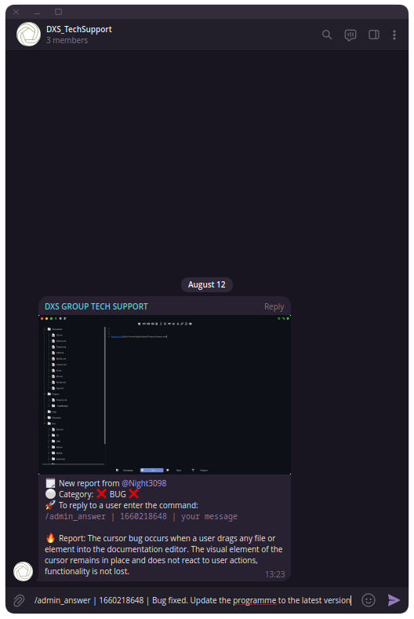
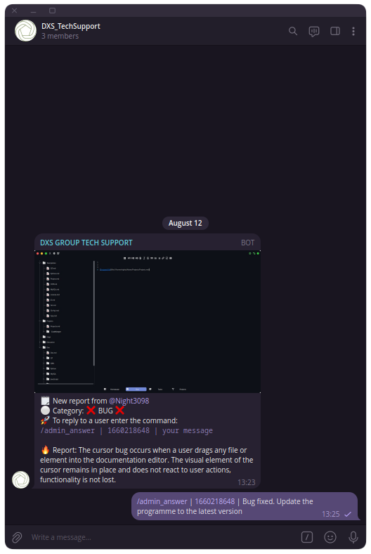

<br><br><br>

<div  align="center">
  
</div>

<br><br><br><br>

<h1 align="center">TechSupport Bot for DXS_GROUP</h1>

### Functional

- Menu items:
    - sending bug report
    - submit a development proposal
    - contacts
    - support the team
    - order development

- User features:
    - sending tickets
    - receiving notifications about ticket status changes
    - receiving notifications from the developer

- Opportunities for developer:
    - tracking tickets in a separate chat room
    - ticket status change
    - sending a notification to the user


> [!TIP]
> All data and links to user attachments are stored in a sqlite database


### Installing

```
git clone https://github.com/Nighty3098/TechSupportBot
cd TechSupportBot
python3 -m venv SupportBot
source SupportBot/bin/activate
pip3 install -r requirements.txt
cd src
SUPPORT_TOKEN="BOT TOKEN" python3 main.py
```

> [!IMPORTANT]
> In the config.py file, set the developer id and chat id. Add a bot to the chat and make it an admin

<details>
<summary align="center">Imgs</summary>
<div align="center">
    
    
    
    
    
</div>
</details>
<br><br>
