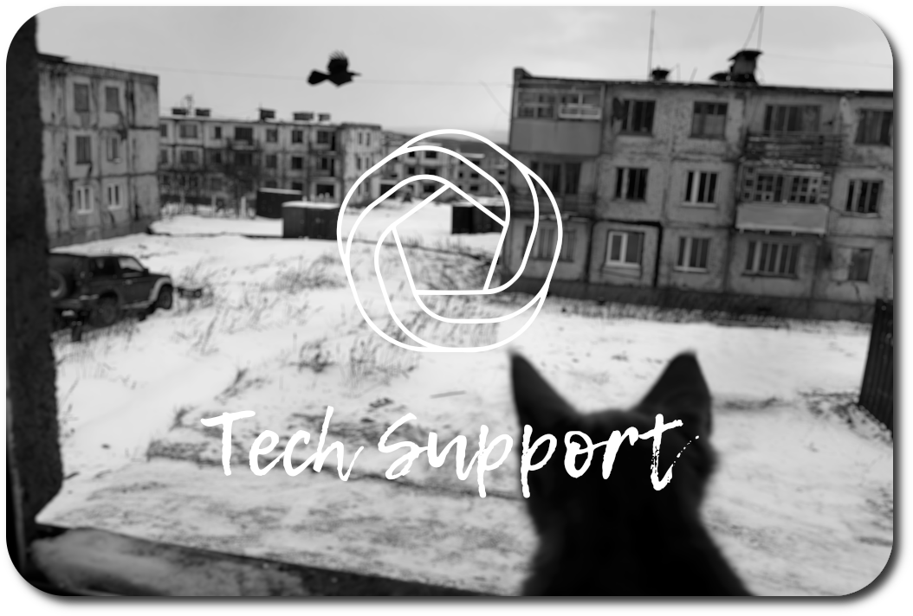
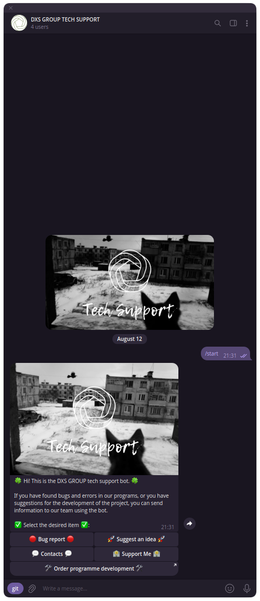
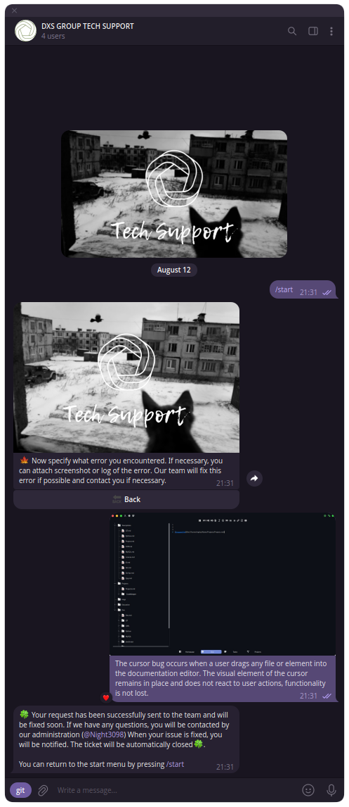
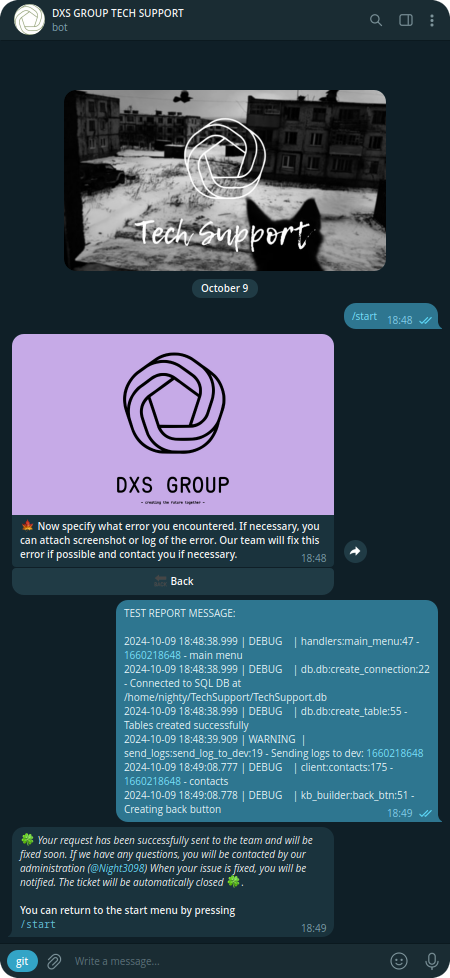
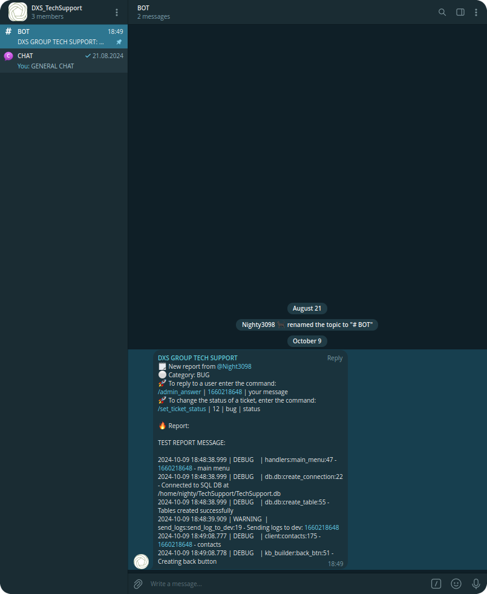
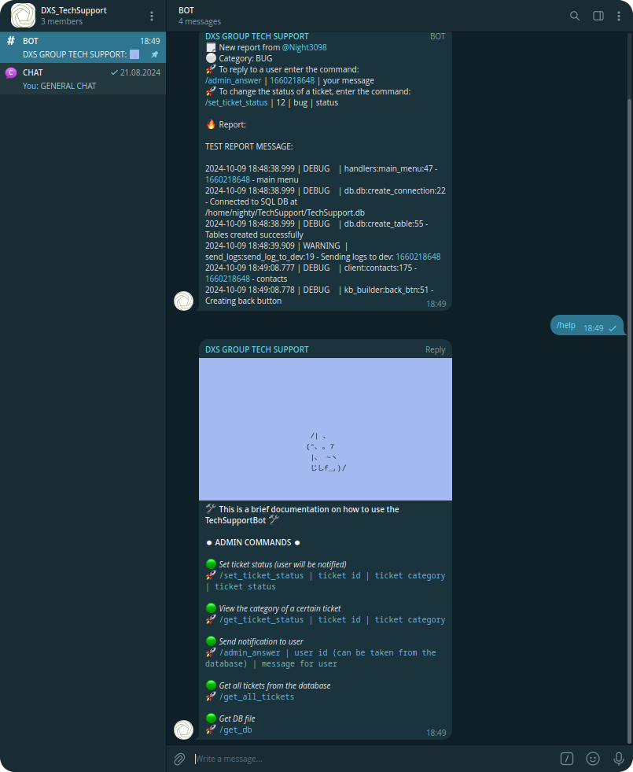

<br><br><br>

<div  align="center">
  
  <br>
  <br>
  
  
</div>

<br><br>

<h1 align="center">TechSupport Bot for DXS_GROUP</h1>

<br><br>

### Functional

- Menu items:

  - sending bug report
  - submit a development proposal
  - contacts
  - support the team
  - order development

- User features:

  - sending tickets
  - receiving notifications about ticket status changes
  - receiving notifications from the developer

- Opportunities for developer:
  - tracking tickets in a separate chat room
  - ticket status change
  - sending a notification to the user

<br><br><br>

### Commands for admin

#### Set ticket status (user will be notified)
`/set_ticket_status | ticket id | ticket category | ticket status`

#### View the category of a certain ticket
`/get_ticket_status | ticket id | ticket category`

#### Send notification to user
`/admin_answer | user id (can be taken from the database) | message for user`

#### Get all tickets from the database
`/get_all_tickets`

#### Get DB file
`/get_db`

<br><br>

> [!TIP]
> All data and links to user attachments are stored in a sqlite database

### Installing

```
git clone https://github.com/Nighty3098/TechSupportBot
cd TechSupportBot
python3 -m venv SupportBot
source SupportBot/bin/activate
pip3 install -r requirements.txt
cd src
SUPPORT_TOKEN="BOT TOKEN" python3 main.py
```

> [!IMPORTANT]
> In the config.py file, set the developer id and chat id. Add a bot to the chat and make it an admin

<details>
<summary align="center">Imgs</summary>
<div align="center">
    
    
    
    
    
</div>
</details>
<br><br>
